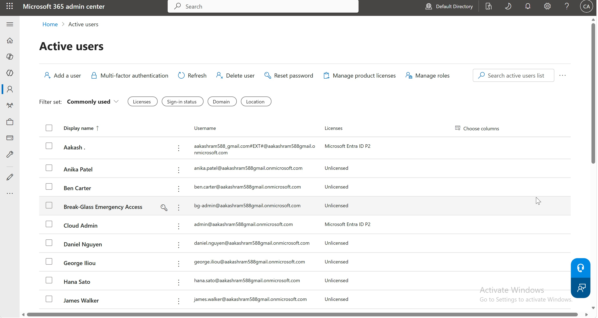
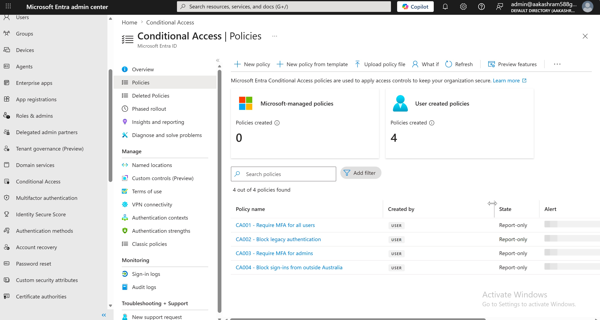
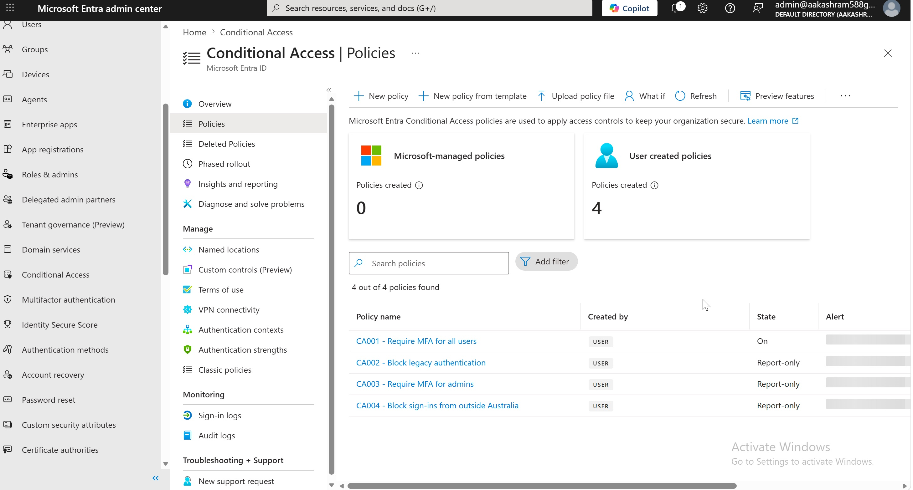
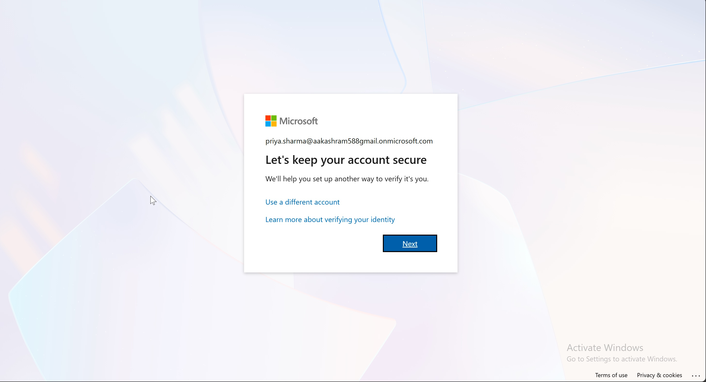

# Phase 1 — Tenant Foundation & Access Management

This phase provisions an enterprise-style Microsoft Entra ID tenant from scratch and establishes a least-privilege access-management baseline using Conditional Access. The goal was not just to make things work, but to make the *design decisions* an identity administrator actually faces — and to document the friction encountered along the way.

---

## 1. What was built

### Identity foundation
- **Cloud-native Global Administrator** (`admin@<tenant>.onmicrosoft.com`) created as a dedicated work account, separate from the tenant-owner identity. All administrative and Graph PowerShell work runs through this account.
- **Break-glass account** (`bg-admin@<tenant>.onmicrosoft.com`) with the Global Administrator role, **excluded from every Conditional Access policy**. Its password is stored offline. This is the emergency-access identity that survives a misconfigured policy or a lost MFA device.
- **15 test users** across three departments (IT, Finance, HR), each with a `department` attribute and a usage location of Australia.

### Groups
- **Static groups** — `sg-it`, `sg-hr` — assigned membership.
- **Dynamic group** — `sg-finance-dynamic` — membership rule `user.department -eq "Finance"`. On creation it auto-populated the five Finance users with no manual assignment, demonstrating attribute-driven membership and the joiner-mover-leaver pattern: change a user's department and their group membership (and any access tied to it) follows automatically.

### Access management — Conditional Access
Security defaults were disabled first (see §2), then four policies were deployed in **report-only** mode, each excluding the break-glass account:

| Policy | Intent | Control |
|--------|--------|---------|
| **CA001** | Require MFA for all users | Grant: require MFA |
| **CA002** | Block legacy authentication | Grant: block (client app types: Exchange ActiveSync, other) |
| **CA003** | Require MFA for admins | Grant: require MFA, scoped to 13 privileged directory roles |
| **CA004** | Block sign-ins from outside Australia | Grant: block, using a country named location (include all locations, exclude Australia) |

---

## 2. Key design decisions

**Separate admin identity from the tenant owner.** The personal Microsoft account that created the tenant is unsuitable for day-to-day administration — the Microsoft 365 admin center rejects personal accounts for many operations, and mixing the owner identity with operational admin work violates separation of duties. A dedicated cloud-native admin account is the correct foundation.

**A break-glass account excluded from all policy.** Conditional Access is powerful enough to lock *everyone* out, including administrators, if a policy is misconfigured. The break-glass account is the deliberate escape hatch: high-privilege, excluded from every CA policy, credentials stored offline, monitored for use. This is standard practice in any production Entra environment.

**Security defaults → Conditional Access.** Security defaults are Microsoft's free, all-or-nothing baseline (force MFA registration, block legacy auth, protect privileged actions) with no tunability. The moment you need *conditional* logic — MFA only from untrusted locations, block legacy auth except for one service account, no admin sign-ins from outside a country — you must disable security defaults and take ownership of protection through Conditional Access. The two are mutually exclusive. Disabling defaults opens a brief protection gap, which is exactly why CA001 was staged ahead of time.

**Stage in report-only before enforcing.** Every policy was created in `enabledForReportingButNotEnforced`. Report-only evaluates policies against real sign-ins and logs what *would* have happened without actually blocking anyone — letting you measure blast radius before flipping to enforced. The production discipline is: deploy report-only → review impact in sign-in logs / the Conditional Access insights workbook → enable one policy at a time.

**Location control is defence-in-depth, not a hard boundary.** CA004 blocks sign-ins from outside Australia, but IP geolocation can be defeated with a VPN. It's a compliance / defence-in-depth layer rather than a strong security control — a distinction worth being explicit about rather than overstating what a country block achieves.

---

## 3. Lessons learned (the friction)

**Entra directory roles ≠ billing roles.** Activating the Entra ID P2 trial required a Microsoft Customer Agreement billing role (Billing account owner), which is completely separate from Entra directory roles like Global Administrator. Being a Global Admin does not grant the ability to make a purchase. The billing role had to be assigned before checkout would succeed.

**Usage location is a hard prerequisite for licensing.** Licenses cannot be assigned to a user without a usage location set first. Every test user (and the admins) needed `UsageLocation = AU` before a P2 license would attach.

**Eventual consistency bites — twice.** Entra ID is a globally distributed directory, so a write doesn't instantly appear on every read replica.
- A newly created user returned `resourceNotFound` when immediately registering MFA.
- A freshly created **named location** returned *"NamedLocation … does not exist in the directory"* when a Conditional Access policy referenced it milliseconds later — even though the create call had just succeeded.

The fix pattern in production provisioning code is a short retry-with-backoff after a write before referencing the new object. In the lab, simply re-running the dependent step (after the replica caught up) succeeded.

**Token staleness on role changes.** Newly assigned roles (and billing permissions) were not reflected until the access token refreshed. Signing out and back in forced a fresh token and resolved a checkout that had been failing on a permission the account already had.

**PowerShell 5.1 vs 7.** The Windows PowerShell 5.1 host hit a fatal *"writing to a listener"* bug during the Graph SDK device-code flow. PowerShell 7 (`pwsh`) resolved it — the working shell for all Graph SDK work.

**P1 vs P2 feature split.** P1 covers Conditional Access, dynamic groups, and self-service password reset with writeback. P2 adds Privileged Identity Management, access reviews, and Identity Protection — the governance and risk-based capabilities needed for Phase 3.

---

## 4. Environment

- Windows VM (VMware Fusion on Apple Silicon)
- Microsoft Edge as the dedicated admin browser
- PowerShell 7 + Microsoft Graph PowerShell SDK
- Graph connection via device-code flow with scoped delegated permissions:
  `User.ReadWrite.All`, `Group.ReadWrite.All`, `Policy.ReadWrite.ConditionalAccess`, `Policy.Read.All`, `Policy.ReadWrite.SecurityDefaults`, `RoleManagement.ReadWrite.Directory`, `Domain.Read.All`

---

## 5. Next steps

- Generate test sign-in traffic, review report-only results in the Conditional Access insights workbook, then enforce CA001–CA004 one at a time.
- Proceed to Phase 2 (OIDC application with PKCE).

---

## Evidence

Screenshots from the deployed and enforced Phase 1 tenant.

**Identities provisioned** - 15 test users plus the dedicated Cloud Admin and the excluded Break-Glass account, with Entra ID P2 assigned to the admin accounts.

**Conditional Access baseline (report-only)** - all four policies (CA001-CA004) staged in report-only first: evaluating real sign-ins and logging impact without blocking anyone.

**CA001 enforced** - flipped from report-only to On, while CA002-CA004 remain report-only. Admins are not exempt; only the dedicated break-glass account is excluded, as the deliberate recovery path.

**MFA enforcement verified** - a standard user (priya.sharma) signing in is stopped and required to register MFA. Direct, end-to-end proof the enforced policy works.

