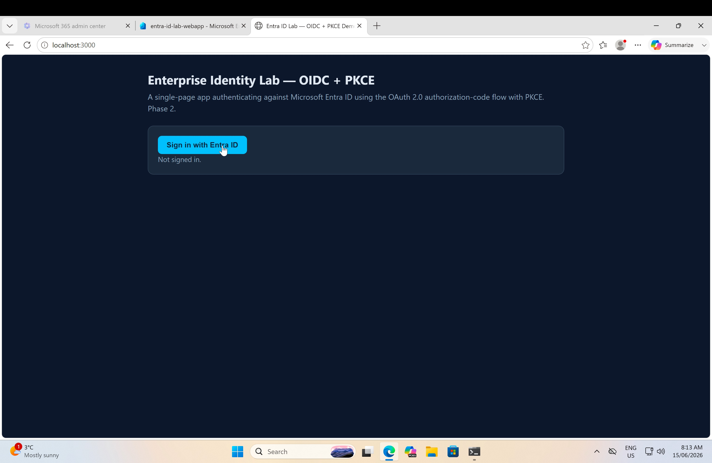
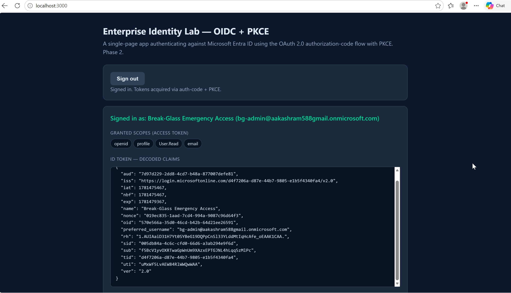
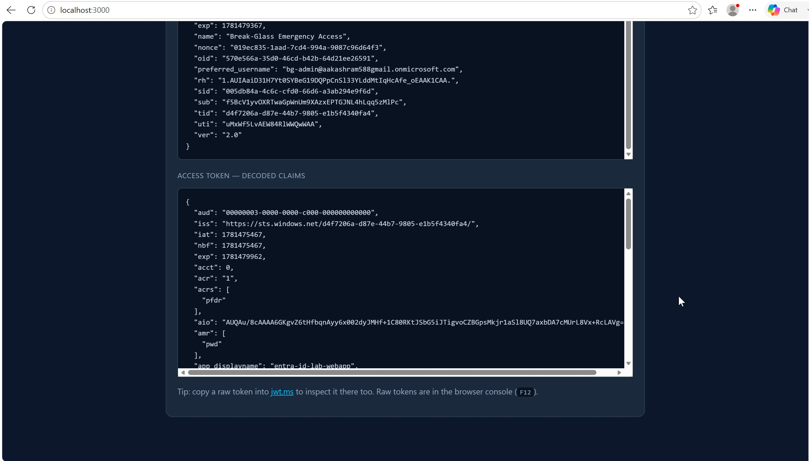
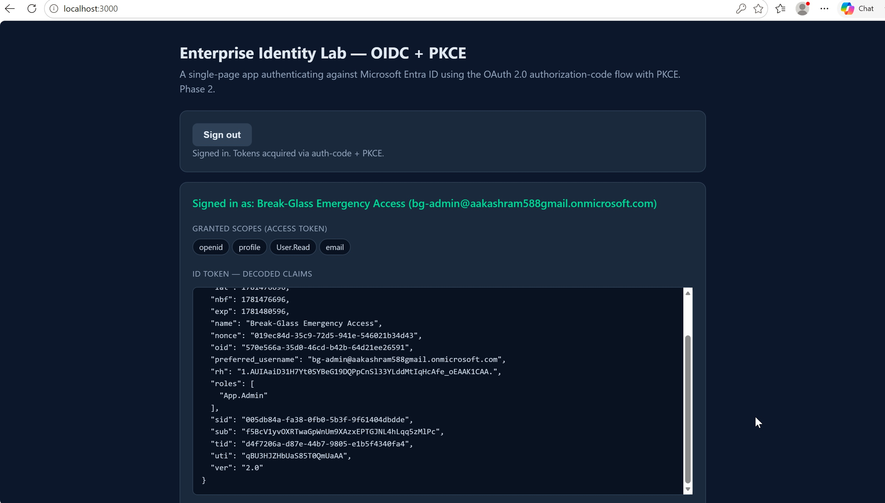

# Phase 2 — Workload Identity, OIDC + PKCE & App Roles

This phase builds a real application that authenticates against Microsoft Entra ID using the OAuth 2.0 **authorization-code flow with PKCE**, then layers on **app roles (RBAC)**. It moves the lab from "configuring identity" (Phase 1) to "consuming identity" — registering a workload, signing users in with a standards-based flow, and reading the resulting tokens to make authentication and authorization decisions.

---

## 1. What was built

- An **app registration** in Entra ID (single-tenant, SPA platform, redirect URI `http://localhost:3000`, no implicit grant).
- A **single-page application** (`app/index.html`) using **MSAL.js** that signs users in via the **authorization-code flow with PKCE** and decodes the resulting tokens on screen.
- **App roles** defined on the registration (`App.Admin`, `App.Reader`) and assigned to a user on the enterprise application, producing a **`roles`** claim in the token.

---

## 2. Why authorization-code + PKCE

PKCE (Proof Key for Code Exchange) protects the authorization-code flow for **public clients** — apps that can't keep a secret, like a single-page app or a mobile app. The problem it solves: a public client has no client secret, so if an attacker intercepted the authorization code, they could redeem it themselves. PKCE closes that gap:

1. Before redirecting to the login page, the app generates a random secret (the **code verifier**) and sends only its SHA-256 hash (the **code challenge**, with `code_challenge_method=S256`).
2. After the user authenticates, Entra returns an authorization code.
3. When the app redeems that code for tokens, it must present the original **code verifier**. Entra hashes it and checks it against the challenge it stored.

An intercepted code is therefore useless without the verifier, which never left the client. This is visible in the live flow — the `/authorize` request in the browser address bar contains `code_challenge` and `code_challenge_method=S256`. MSAL.js generates and manages the verifier automatically; it's the default flow for public clients.

The app registration deliberately leaves **implicit grant disabled** — implicit flow (tokens returned directly in the URL fragment) is the older, less secure pattern that auth-code + PKCE replaces.

---

## 3. Token deep-dive

After sign-in the app receives two tokens that look similar but do completely different jobs. The clearest way to see the difference is the **`aud` (audience)** claim.

| | ID token | Access token |
|---|---|---|
| **Purpose** | Authentication — *who logged in* | Authorization — *what the bearer may access* |
| **`aud` (audience)** | `7d97d229-…` (this app's client ID) | `00000003-0000-0000-c000-000000000000` (Microsoft Graph) |
| **Consumed by** | This app | The resource API (Graph) |
| **Issuer** | `login.microsoftonline.com/<tid>/v2.0` | `sts.windows.net/<tid>/` (v1.0 format) |

The takeaway, and a common interview question: **the app reads the ID token; it must not crack open the access token.** The access token is opaque to the client — it just forwards it to Graph as a bearer token. The ID token is the client's "login receipt"; the access token is an "API key for a resource."

### Identity claims worth knowing
- **`oid`** — the user's immutable object ID in the tenant, the same across every application. Use it to correlate a user across apps.
- **`sub`** — the subject; also unique to the user but *pairwise* (different value per app). OIDC's per-app primary key for the user.
- **`tid`** — the tenant ID.
- **`nonce`** — replay protection; binds the token to the specific login request the app initiated.
- **`iat` / `nbf` / `exp`** — the validity window (≈ 60–75 minutes). After `exp`, MSAL silently acquires a fresh token via refresh.

### The `amr` claim — Phase 1 and Phase 2 connecting
The access token's **`amr`** (authentication methods reference) read `["pwd"]` — password only, no MFA. That is the direct, in-token evidence of a Phase 1 design choice: the break-glass account is **excluded from the CA001 MFA policy**, so it authenticated with a password alone. A normal user who completed MFA would show `["pwd","mfa"]`. The access-management policy from Phase 1 is observable in the token issued in Phase 2.

---

## 4. App roles & RBAC

App roles move authorization out of the application's own code and into the identity platform.

1. **Define** the role on the **app registration** → App roles (`App.Admin`, value `App.Admin`, member type Users/Groups).
2. **Assign** an identity to the role on the **enterprise application** → Users and groups. (Definition and assignment live in two different places — the app registration is the blueprint, the enterprise application is the live instance in the tenant.)
3. On the next sign-in, Entra injects a **`roles`** claim into the token:

```json
"roles": [
  "App.Admin"
]
```

The application then authorizes with a single check against a **signed token from Entra** — `claims.roles?.includes("App.Admin")` — rather than trusting its own database or a client-supplied flag. Change the assignment in Entra and the role in the token changes on next login: centralized, auditable, revocable RBAC.

---

## 5. Firebase Authentication vs Entra ID

Having built authentication on **Firebase Authentication** during an internship and on **Entra ID** here, the contrast is instructive — they solve overlapping problems for very different audiences.

| | Firebase Authentication | Microsoft Entra ID |
|---|---|---|
| **Primary audience** | Consumer / customer-facing apps (CIAM) | Workforce / enterprise (and CIAM via External ID) |
| **Identity source** | The app's own user pool | An organizational directory of users, groups, devices |
| **Protocols** | Firebase SDK + JWTs; federates to Google, Apple, etc. | Standards-first: OIDC, OAuth 2.0, SAML, WS-Fed |
| **Authorization model** | Custom claims + Firebase Security Rules | App roles, group claims, OAuth scopes |
| **MFA / policy** | Basic MFA (SMS/TOTP) | Policy-driven Conditional Access, risk-based (Identity Protection) |
| **Governance** | Minimal | PIM (just-in-time admin), access reviews, audit logs |
| **Best fit** | Ship a consumer app's login fast | Govern who-can-access-what across an organization |

In short: **Firebase Auth optimizes for developer speed on a consumer app**; you get login working in an afternoon and authorize with custom claims. **Entra ID optimizes for enterprise governance**; the directory, Conditional Access, PIM, app roles and access reviews exist because the hard problem isn't *logging a user in*, it's *governing access at scale and proving it to an auditor*. The token deep-dive above shows it concretely — the same OIDC JWT a developer reads from Firebase is, in Entra, the output of a policy engine (Conditional Access, MFA, role assignment) that an organization controls centrally.

---

## 6. Environment

- Node.js (for the local static server) + MSAL.js 3.x (browser CDN)
- App served locally with `npx http-server -p 3000`
- Microsoft Edge for the sign-in flow
- Single-tenant app registration in the Phase 1 tenant

---

## 7. Evidence

**The application** — a single-page app ready to start the OIDC + PKCE flow.



**ID token (decoded)** — audience is this app's client ID; identity claims (`oid`, `sub`, `tid`, `name`, `preferred_username`) and the validity window.



**Access token (decoded)** — audience is Microsoft Graph (not this app), a different issuer, and `amr: ["pwd"]` showing this session skipped MFA (break-glass excluded from CA001).



**RBAC** — after assigning the user the `App.Admin` app role, Entra stamps a `roles` claim into the token.



---

## 8. Next steps

- Enforce the role in the app UI (gate an admin-only feature on `roles.includes("App.Admin")`).
- Proceed to Phase 3 — identity governance (PIM, access reviews) and forwarding Entra sign-in/audit logs to the Wazuh SIEM for identity threat detection.
